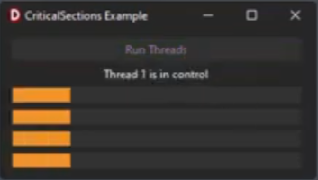

<h1>Delphi Multithreading Example (Using Critical Sections)</h1>

This Delphi VCL application demonstrates multithreading with two threads competing to update a user interface containing progress bars and labels. The example highlights the use of critical sections to ensure thread safety during UI updates.

  

<h2>Features</h2>
<ul>
  <li><strong>Two Threads:</strong> Both threads attempt to update four progress bars simultaneously.</li>
  <li><strong>Critical Sections:</strong> Uses <code>TCriticalSection</code> to prevent concurrent access to the UI.</li>
  <li><strong>Thread Synchronization:</strong> UI updates are managed with <code>TThread.Synchronize</code> to maintain thread safety.</li>
</ul>

<h2>How It Works</h2>
<ul>
  <li>The application starts two threads when a button is clicked.</li>
  <li>Each thread updates the progress bars and a label, with each progress bar incrementing by 5 until reaching 100.</li>
  <li>Critical sections ensure that only one thread can update the UI at a time, preventing race conditions.</li>
  <li>Once both threads complete their tasks, the button is re-enabled.</li>
</ul>

<h2>Watch the Demo</h2>

Check out the demo video on YouTube: <a href="https://youtu.be/k5rdp5FfzII" target="_blank">Delphi Multithreading Demo</a>

<h2>Getting Started</h2>
<ol>
  <li>Clone the repository.</li>
  <li>Open the project in Delphi RAD Studio.</li>
  <li>Run the application.</li>
</ol>

<h2>License</h2>

This project is licensed under the <a href="https://opensource.org/licenses/MIT" target="_blank">MIT License</a>.

<h2>📧 Contact</h2>

Discord: <strong>BitmasterXor</strong>

Made with ❤️ by: <strong>BitmasterXor</strong>, using Delphi RAD Studio

